# Body Level Classification

## Table of Contents

- [Body Level Classification](#body-level-classification)
  - [Table of Contents](#table-of-contents)
  - [Problem and Dataset Description](#problem-and-dataset-description)
  - [Exploratory Data Analysis](#exploratory-data-analysis)
    - [Dataset](#dataset)
    - [Univariate Analysis](#univariate-analysis)
      - [Target Variable Analysis](#target-variable-analysis)
      - [Features Analysis](#features-analysis)
        - [Numerical Features Distribution](#numerical-features-distribution)
        - [Categorical Features Distribution](#categorical-features-distribution)
    - [Multivariate Analysis](#multivariate-analysis)
      - [Correlation Analysis](#correlation-analysis)
      - [Relation Between Gender and Body Level](#relation-between-gender-and-body-level)
      - [Relation Between Numerical Feature and Body Level](#relation-between-numerical-feature-and-body-level)
      - [The Pairwise Between The Features And The Target Variable](#the-pairwise-between-the-features-and-the-target-variable)
  - [Models Analysis](#models-analysis)
    - [Base Model](#base-model)
    - [Logistic Regression](#logistic-regression)
      - [Feature Importance Plot](#feature-importance-plot)
      - [Partial Dependence Analysis](#partial-dependence-analysis)
      - [Learning Curves Plot](#learning-curves-plot)
      - [Hyperparameter Tuning](#hyperparameter-tuning)
        - [Grid Search](#grid-search)
        - [Train-Validation Curve](#train-validation-curve)
      - [Bias-variance Analysis](#bias-variance-analysis)
      - [Decision Boundary Plot](#decision-boundary-plot)
    - [Support Vector Machines](#support-vector-machines)
      - [Feature Importance Plot](#feature-importance-plot-1)
      - [Learning Curves Plot](#learning-curves-plot-1)
      - [Partial Dependence Plot](#partial-dependence-plot)
      - [Hyperparameter Tuning](#hyperparameter-tuning-1)
        - [Grid Search](#grid-search-1)
        - [Train-Validation Curve](#train-validation-curve-1)
      - [Bias-variance Analysis](#bias-variance-analysis-1)
      - [Decision Boundary Plot](#decision-boundary-plot-1)
        - [Linear Kernel](#linear-kernel)
        - [RBF Kernel](#rbf-kernel)
    - [Random Forest](#random-forest)
      - [Feature Importance Plot](#feature-importance-plot-2)
      - [Learning Curves Plot](#learning-curves-plot-2)
      - [Partial Dependence Plot](#partial-dependence-plot-1)
      - [Hyperparameter Tuning](#hyperparameter-tuning-2)
        - [Grid Search](#grid-search-2)
        - [Train-Validation Curve](#train-validation-curve-2)
      - [Bias-variance Analysis](#bias-variance-analysis-2)
      - [Tree Plot](#tree-plot)
        - [Variable importance](#variable-importance)
        - [Interactions between features](#interactions-between-features)
        - [Overfitting](#overfitting)
  - [Conclusion](#conclusion)
  - [Appendix](#appendix)
    - [Regularization](#regularization)
    - [Logistic Regression Parameters](#logistic-regression-parameters)
    - [The C parameter and the maximum-a-posterior Estimation](#the-c-parameter-and-the-maximum-a-posterior-estimation)
    - [Gini Value in a Random Forest Tree Plot](#gini-value-in-a-random-forest-tree-plot)
    - [Bias-variance Tradeoff](#bias-variance-tradeoff)

## Problem and Dataset Description

We are solving a classification problem for human body level based on some given attributes related to the physical, genetic and habitual conditions. The given attributes are both categorical and continuous. The human body level can be categorized into (4 levels/classes).
We are given 16 attributes and 1477 data samples, where classes are not evenly distributed. We are trying to build models that can adapt to the class imbalance to achieve the best possible results.

## Exploratory Data Analysis

### Dataset

| Column             |  Data Type | Data Format |
| ------------------ |  --------- | ----------- |
| Gender             |  Nominal   | String      |
| Age                |  Ratio     | Float       |
| Height             |  Ratio     | Float       |
| Weight             |  Ratio     | Float       |
| H_Cal_Consump      |  Nominal   | String      |
| Veg_Consump        |  Interval  | Float       |
| Water_Consump      |  Interval  | Float       |
| Alcohol_Consump    |  Nominal   | String      |
| Smoking            |  Nominal   | String      |
| Meal_Count         |  Interval  | Float       |
| Food_Between_Meals |  Nominal   | String      |
| Fam_Hist           |  Nominal   | String      |
| H_Cal_Burn         |  Nominal   | String      |
| Phys_Act           |  Interval  | Float       |
| Time_E_Dev         |  Interval  | Float       |
| Transport          |  Nominal   | String      |
| Body_Level         |  Nominal   | String      |

### Univariate Analysis

The univariate analysis involves analyzing each variable individually. It looks at the range of values and the central tendency of the values. It describes the pattern of response to the variable. It represents each variable on its own.

#### Target Variable Analysis

We started by analyzing the distribution of the target variable and found an imbalance in our data set where one class dominated the others. This issue needs to be addressed as unequal representation of classes in our data set can lead to biased results when training machine learning algorithms. Techniques like oversampling the minority class, undersampling the majority class, or utilizing cost-sensitive sampling can be implemented to balance the data set.
<div style="text-align:center">
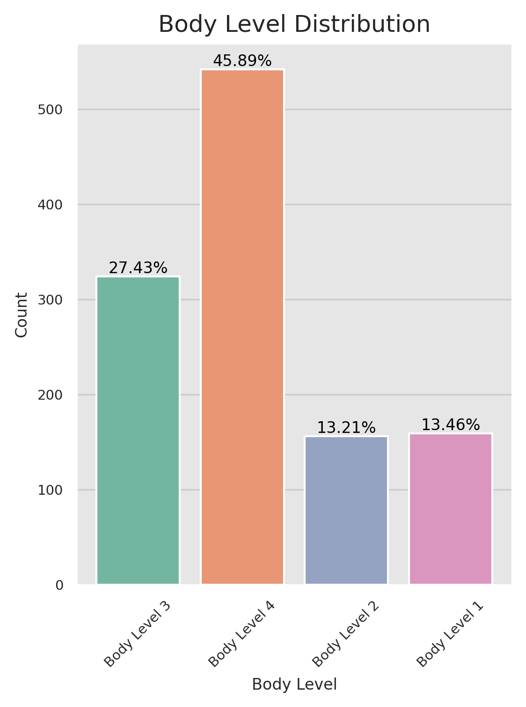
</div>

#### Features Analysis

##### Numerical Features Distribution

- We can find that the `Height` follows a normal distribution.
- We can find that the `Age` feature is left skewed, we have more values for youth than the elders.
- We can find that most of the `Veg_Consump`, `Water_Consump`, `Meal_Count`, `Phys_Act`, and `Tine_E_Dev` are rounded to be integers.
- We can find that there's data capping in most of the features too.
    
>> Data capping is a technique used in data science to limit the maximum value of a variable in a dataset. This is often done to avoid the influence of outliers, or extreme values, that can skew the results of statistical analysis or machine learning models. By setting a cap, any values above that limit are truncated to the maximum value, allowing the analysis to focus on the most representative data points within the dataset.

<div style="text-align:center">

</div>

##### Categorical Features Distribution

- We can find that most of the features are unbalanced, this makes them somehow useless in solving our problem except for the `Gender` feature i.e. we may use this feature in our analysis.

<div style="text-align:center">
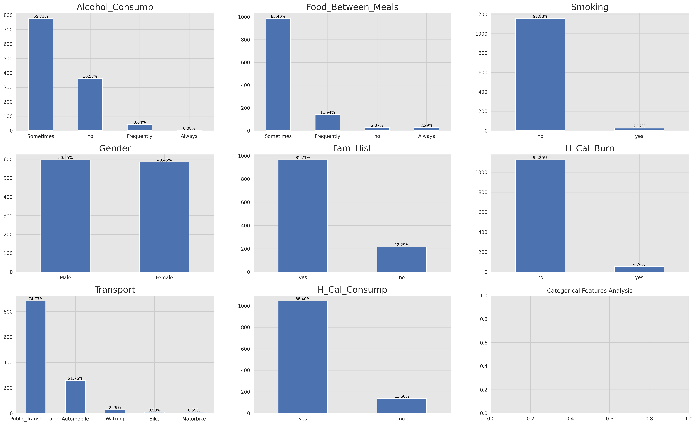
</div>

### Multivariate Analysis

The multivariate analysis involves analyzing more than one variable to determine the relationship between them. It looks at the interactions between variables. It is used to identify patterns in the data set. It represents each variable in relation to all other variables.

#### Correlation Analysis

Correlation analysis allows us to assess the redundancy of certain features. If two features are highly correlated, they may provide similar information, and including both in our analysis could lead to overfitting or unnecessary complexity. Identifying and addressing such redundancies can help us streamline our feature selection process and improve the efficiency of our models.

<div style="text-align:center">
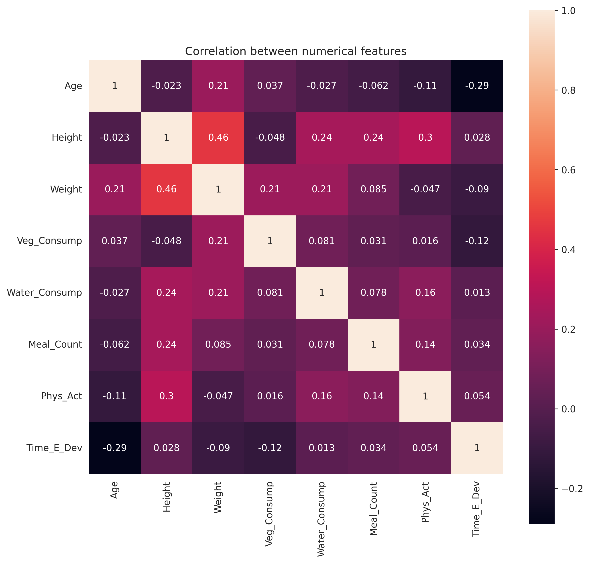
</div>

One of the methods to measure the correlation between variables is the `person` correlation coefficient. It is a measure of the linear correlation between two variables X and Y. It has a value between +1 and −1, where 1 is total positive linear correlation, 0 is no linear correlation, and −1 is total negative linear correlation. It is widely used in the sciences as a measure of the strength of linear dependence between two variables. After visualizing the corr using a heatmap we can find that there is a correlation between the width and the height features which is expected.


#### Relation Between Gender and Body Level
As we mentioned earlier that the `Gender` feature is the only categorical feature that can be  useful in our analysis. So we started by analyzing the relation between the `Gender` and the `Body_Level` features. We can find that the `Gender` feature is not a good predictor for our target variable because the Males and Females have almost the same distribution for the `Body_Level` feature.

<div style="text-align:center">
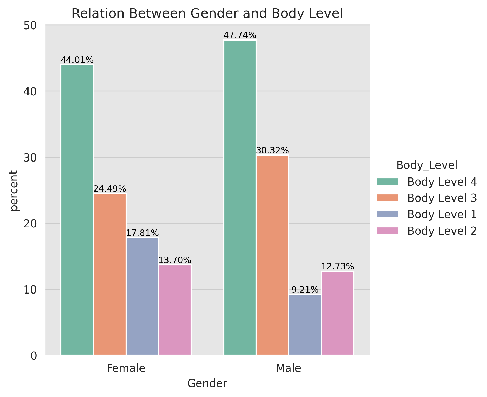
</div>

#### Relation Between Numerical Feature and Body Level

In order to analyze the relation between the numerical features and the target variable we can visualize the distribution of the numerical features for each class of the target variable. If the distribution of the numerical feature is different for each class of the target variable then this feature is a good predictor for the target variable.

<div style="text-align:center">

</div>

We can notice that the `Weight` feature is an important and significant feature. It carries a lot of predictive power and is highly correlated with the target variable. We can use it to build some models that can accurately predict the target variable.


#### The Pairwise Between The Features And The Target Variable

One of the important analysis we can do during the EDA is to analyze the pairwise between the features. This analysis can help us to identify the most important features that can be used to build our models.

We can notice that the `Weight` and `Height` are significant features that carry a lot of predictive power and are highly correlated with the target variable. We can use them or a mix of them to build our models.

<div style="text-align:center">

</div>

## Models Analysis

All the analysis is made on the **Width** and **Height** features, as we have shown that they are the most significant and important ones.

All models are validated using cross-validation with **10 folds**.

### Base Model

Before working on developing sophisticated machine learning models, we used some dummy models to as a baseline model to compare the performance of more sophisticated models. By comparing the performance of a complex model to that of a simple model, we can determine if the complex model is actually providing useful predictions or if it is overfitting the data. Dummy models also help identify if the problem has any inherent bias or if the dataset is imbalanced. Overall, starting with a dummy model is a good way to get a baseline understanding of the data and the problem before moving on to more complex models.

| Strategy   | Description  | Cross-validation   |
|:---: |:---: |:---: |
| **most_frequent**  | The predict method always returns the most frequent class label in the observed y argument passed to fit. The predict_proba method returns the matching one-hot encoded vector.  | **accuracy**:  0.4589374732944025 **f1_macro**:  0.1572825648608684 **f1_micro**:  0.4589374732944025  |
| **stratified**  | The predict_proba method randomly samples one-hot vectors from a multinomial distribution parametrized by the empirical class prior probabilities. The predict method returns the class label which got probability one in the one-hot vector of predict_proba. Each sampled row of both methods is therefore independent and identically distributed.  | **accuracy**:  0.3014171770403077 **f1_macro**:  0.23061576938678968 **f1_micro**:  0.3014171770403077  |
| **uniform**  | Generates predictions uniformly at random from the list of unique classes observed in y, i.e. each class has equal probability  | **accuracy**:  0.25400227887765275 **f1_macro**:  0.22286412555245022 **f1_micro**:  0.25400227887765275  |

### Logistic Regression

Logistic regression is a powerful tool for predicting categorical outcomes. It is used in a wide variety of fields, including marketing, medicine, and finance. For example, logistic regression can be used to predict the likelihood that a customer will buy a product, the likelihood that a patient will develop a disease, or the likelihood that a company will go bankrupt.

- The advantages of using logistic regression
  - It is a simple and straightforward method to predict categorical outcomes.
  - It can be used to predict the probability of an outcome for any given combination of predictor values.
  - It is relatively easy to interpret the results of a logistic regression model.

- The disadvantages of using logistic regression
  - It can be sensitive to outliers in the data.
  - It can be difficult to interpret the results of a logistic regression model when there are multiple independent variables.
  - It can be computationally expensive to fit a logistic regression model with a large number of independent variables.

Overall, logistic regression is a powerful tool for predicting categorical outcomes. It is relatively easy to use and interpret, and it can be used in a wide variety of fields.

>> To learn more about the logistic regression parameters, check the [Logistic Regression Parameters](#logistic-regression-parameters) section in the Appendix.
>>
#### Feature Importance Plot

To interpret the results of a logistic regression model, we can use the feature weights to determine the importance of each feature in the model and visualize the results.

This feature importance plot shows the importance of each feature in the model to understand there impact on the model's predictions.

<div style="text-align:center">

</div>

Based on the feature importance graph, it seems that `Weight` has a much higher importance compared to `Height` for the logistic regression model. In fact, `Weight` accounts for approximately 79% of the importance, while "Height" only accounts for 21%.

There are a few possible explanations for this. First, `Weight` is a more direct measure of body level than `Height`. Second,  `Weight` is more variable than `Height`, which means that it has a greater impact on the outcome variable.


#### Partial Dependence Analysis

A partial dependence plot shows the relationship between a feature and the model's predictions while holding all other features constant. It can be used to understand the impact of a single feature on the model's predictions i.e. PDPs show the average effect on predictions as the value of feature changes.

<div style="text-align:center">

</div>

From the plots we can see the relationship between the `Weight` and `Height` features and the model's predictions. We can see that the relationship between the `Height` and the model's predictions is linear and positive, which means that the body level metric increases as the `Height` increases. We can also see that the relationship between the `Weight` and the model's predictions is non-linear and negative, which means that the body level metric decreases as the `Weight` increases.

#### Learning Curves Plot

show the training error (Ein) and validation error (Eval) as a function of the training set size

<div style="text-align:center">

</div>

```python
Used parameters: {'C': 0.1, 'penalty': 'l2', 'solver': 'saga'}
```

The learning curves plot shows that the model is slightly overfitting the training data. The training error is lower than the validation error, which means that the model is not generalizing well to unseen data. This is a common problem with logistic regression models, and it can be addressed by using some techniques such as regularization as shown in the [Regularization](#regularization) section in the Appendix.

#### Hyperparameter Tuning

This is a process of adjusting the parameters of a model to optimize its performance. It can be done using techniques like grid search, random search, or Bayesian optimization.

##### Grid Search

For

```python
param_grid = {
    'penalty': ['l1', 'l2'],
    'C': [0.001, 0.01, 0.1, 1, 10, 100],
    'solver': ['liblinear', 'saga']
}
```

We found that the best parameters are:

```python
Best parameters found: {'C': 10, 'penalty': 'l1', 'solver': 'saga'}
```

With training score: `0.9710438585061565` and test score: `0.966636441509922`

Here are some heatmap visualizations of the grid search results:
<div style="display: flex; flex-direction: row; style="text-align:center"">

</div>

##### Train-Validation Curve

Here are some Train-Validation Curves that we further used for the hyperparameter tuning process:

<div style="display: flex; flex-direction: row; style="text-align:center"">


</div>

#### Bias-variance Analysis

```yaml
bias:  0.09549356540084387
var:  0.024400949367088608
```

```python
Used parameters: {'C': 0.1, 'penalty': 'l2', 'solver': 'saga'}
```

In our problem, we can see that the model has a low bias and a low variance, which means that it is well-fitted to the data and can generalize well to new, unseen data.

>> For more information on the Bias-variance tradeoff, read the [Bias-variance Tradeoff](#bias-variance-tradeoff) section in the appendix.

#### Decision Boundary Plot

This is plot shows the decision boundary of the model. It can help visualize how the model separates the classes in the dataset

<div style="text-align:center">

</div>

```python
Used parameters: {'C': c, 'penalty': 'l2', 'solver': 'saga'}
```

From the plots we can see that increasing the regularization parameter `C` results in better decision boundaries. This is because increasing the regularization parameter `C` increases the penalty for misclassifying data points, which means that the model becomes less likely to overfit the training data.

We can also see that the decision boundaries are simple, that's because we have chosen the most significant features to work with.

The plots also show the feature importance, the decision boundary is strongly influenced by the `Weight`, as we see a steep slope or abrupt change in the decision boundary around it. This emphasize our previous conclusion that the `Weight` feature is the most important feature.

### Support Vector Machines

Support Vector Machines (SVMs) are a class of supervised learning algorithms used for classification and regression analysis. SVMs work by finding the hyperplane that best separates the data into different classes. The hyperplane that maximizes the margin between the two classes is chosen as the optimal decision boundary. In the case where the data is not linearly separable, SVMs use a kernel trick to map the data into a higher-dimensional space where the data can be linearly separated.

- Advantages of SVM:
  - Effective in high-dimensional spaces: SVMs can perform well in high-dimensional spaces, making them useful for solving complex problems with many features.
  - Robust against overfitting: SVMs are less prone to overfitting than other classification algorithms because they try to maximize the margin between classes, which helps prevent the model from being too closely fit to the training data.
  - Versatile: SVMs can be used for both linear and nonlinear classification and regression tasks, and different kernel functions can be used to handle different types of data.
  - Works well with small and large datasets: SVMs are computationally efficient and can work well with small and large datasets.

- Disadvantages of SVM:
  - Can be sensitive to the choice of kernel: SVM performance depends heavily on the choice of kernel, which can be challenging to choose correctly.
  - Requires careful preprocessing of data: SVMs are sensitive to the scale of the input features, so data preprocessing is required to standardize the features.
  - Computationally intensive: SVMs can be computationally intensive, particularly for large datasets and complex kernel functions.
  - Binary classification only: SVMs are designed for binary classification problems, which means they need to be modified for multi-class classification tasks.

In summary, SVMs are a powerful and flexible classification algorithm that can be used for a wide range of tasks. However, they require careful preprocessing of data, can be sensitive to the choice of kernel, and can be computationally intensive.

#### Feature Importance Plot

A feature importance plot shows the importance of each feature in the model. It can be used to identify the most important features and to understand the impact of each feature on the model's predictions.

<div style="text-align:center">
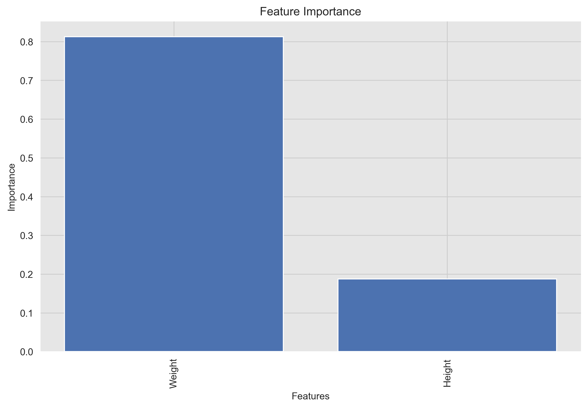
</div>

Based on the feature importance graph, it seems that `Weight` has a much higher importance compared to `Height` for the logistic regression model. In fact, `Weight` accounts for approximately 80% of the importance, while "Height" only accounts for 20%.

There are a few possible explanations for this. First, `Weight` is a more direct measure of body level than `Height`. Second,  `Weight` is more variable than `Height`, which means that it have a greater impact on the outcome variable.

#### Learning Curves Plot

show the training error (Ein) and validation error (Eval) as a function of the training set size

<div style="text-align:center">
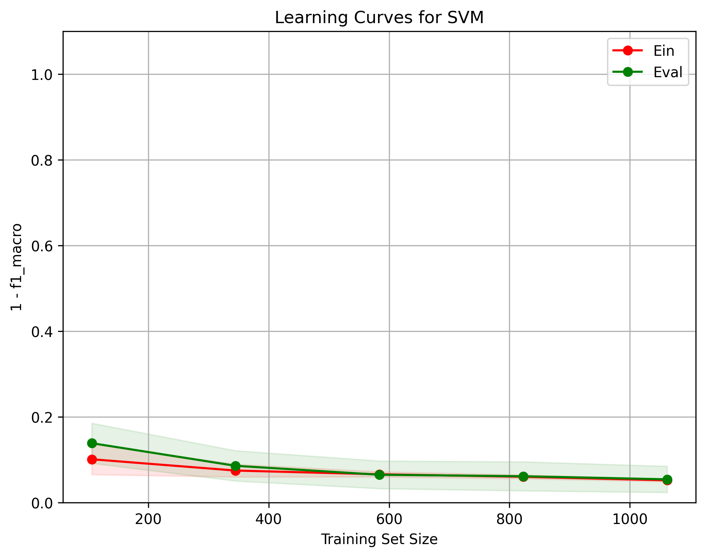
</div>

```python
Used parameters: {`gamma`: 'auto', `kernel`: 'linear', `C`: 0.1, `random_state`: 0}
```

The learning curves plot shows that the model is slightly overfitting the training data. The training error is lower than the validation error, which means that the model is not generalizing well to unseen data. This is a common problem with logistic regression models, and it can be addressed by using some techniques such as regularization.

#### Partial Dependence Plot

A partial dependence plot shows the relationship between a feature and the model's predictions while holding all other features constant. It can be used to understand the impact of a single feature on the model's predictions i.e. PDPs show the average effect on predictions as the value of feature changes.

<div style="text-align:center">

</div>

From the plots we can see the relationship between the `Weight` and `Height` features and the model's predictions. We can see that the relationship between the `Height` and the model's predictions is linear and positive, which means that the body level metric increases as the `Height` increases. We can also see that the relationship between the `Weight` and the model's predictions is non-linear and negative, which means that the body level metric decreases as the `Weight` increases.

#### Hyperparameter Tuning

This is a process of adjusting the parameters of a model to optimize its performance. It can be done using techniques like grid search, random search, or Bayesian optimization.

##### Grid Search

For

```python
param_grid = {
    'C': [0.1, 1, 10, 100],
    'gamma': [0.1, 1, 10, 100],
    'kernel': ['rbf', 'linear']
}
```

We found that the best parameters are:

```python
Best parameters found: {'C': 100, 'gamma': 0.1, 'kernel': 'rbf'}
```

With training score: `0.9818692700792588` and test score: `0.9915779695351935`

Here are some heatmap visualizations of the grid search results:
<div style="display: flex; flex-direction: row; style="text-align:center"">
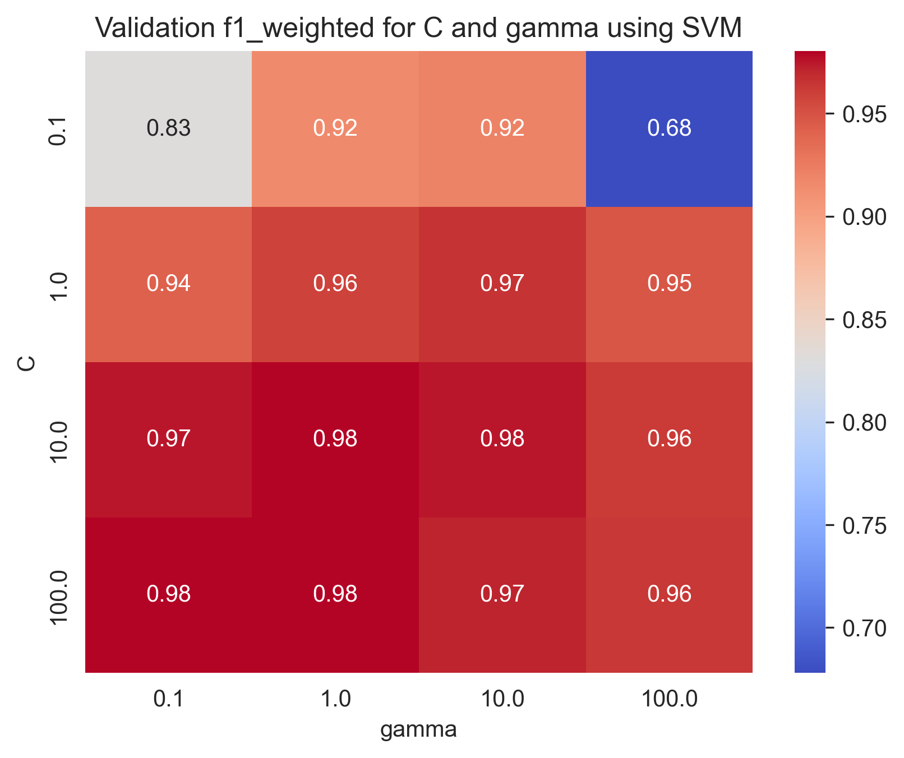
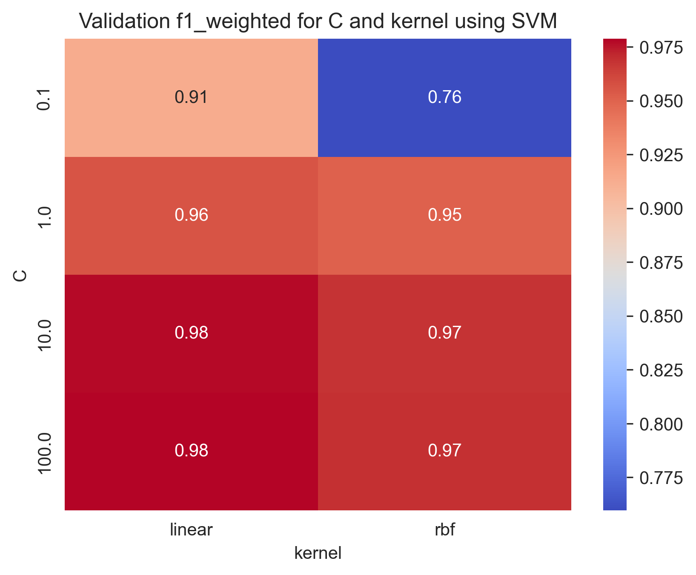
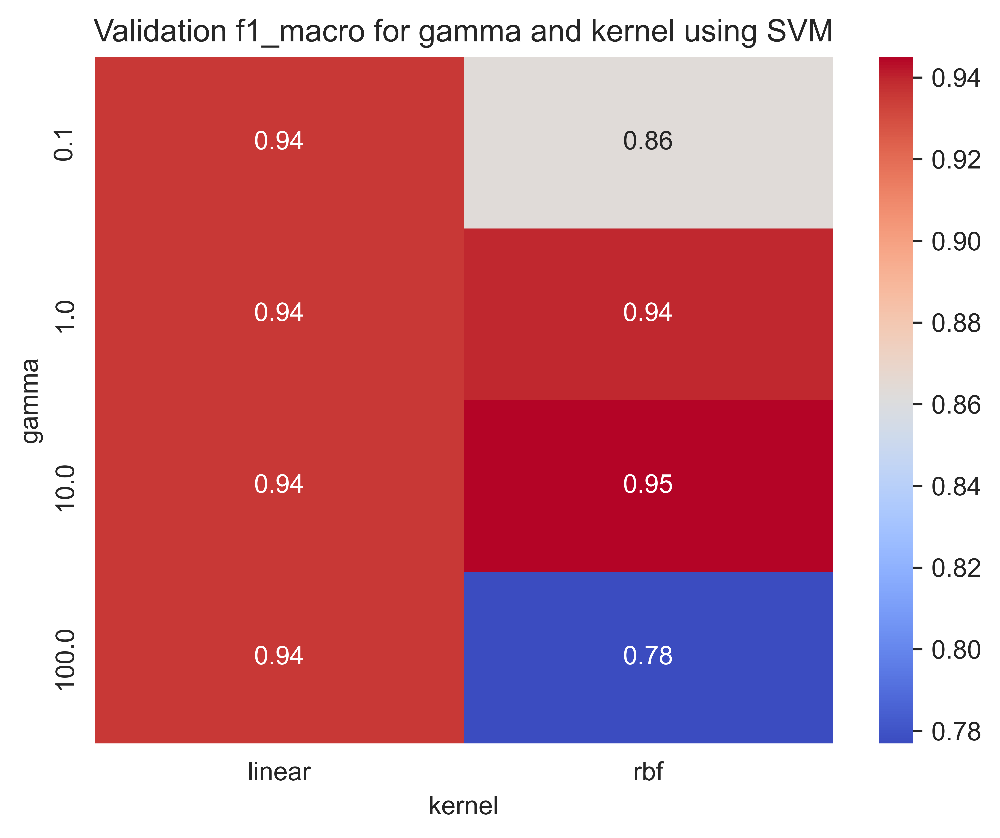
</div>

##### Train-Validation Curve

Here are some Train-Validation Curves that we further used for the hyperparameter tuning process:

<div style="display: flex; flex-direction: row; style="text-align:center"">


</div>

#### Bias-variance Analysis

```yaml
bias:  0.014956751054852323
var:  0.004368143459915612
```

```python
Used parameters: {'C': 100, 'gamma': 0.1, 'kernel': 'rbf'}
```

In our problem, we can see that the model has a low bias and a low variance, which means that it is well-fitted to the data and can generalize well to new, unseen data.

>> For more information on the Bias-variance tradeoff, read the [Bias-variance Tradeoff](#bias-variance-tradeoff) section in the appendix.

#### Decision Boundary Plot

This is plot shows the decision boundary of the model. It can help visualize how the model separates the classes in the dataset

```python
Used parameters: {'C': 100, 'gamma': 0.1, 'kernel': kernel}
```

##### Linear Kernel

<div style="text-align:center">
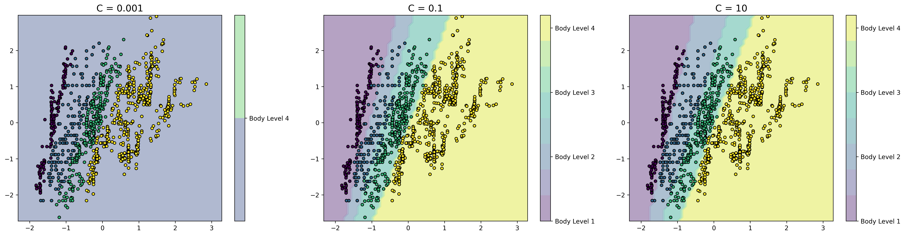
</div>

##### RBF Kernel

<div style="text-align:center">
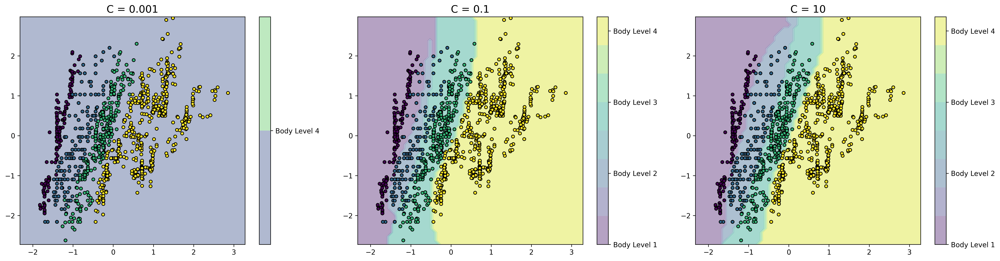
</div>

From the plots we can see that increasing the regularization parameter `C` results in better decision boundaries. This is because increasing the regularization parameter `C` increases the penalty for misclassifying data points, which means that the model becomes less likely to overfit the training data.

We can also see that the decision boundaries are simple, that's because we have chosen the most significant features to work with.

The plots also show the feature importance, the decision boundary is strongly influenced by the `Weight`, as we see a steep slope or abrupt change in the decision boundary around it. This emphasize our previous conclusion that the `Weight` feature is the most important feature.

We can notice that the choice of kernel in SVM affects the decision boundary and the classification performance of the model. Linear kernel assumes that the data is linearly separable in the feature space and constructs a decision boundary as a hyperplane that separates the two classes. On the other hand, RBF (Radial Basis Function) kernel is more flexible and can model non-linear decision boundaries.
As we can see, the linear kernel SVM constructs a linear decision boundary that separates the two classes. However, it fails to capture the non-linear nature of the data. On the other hand, the RBF kernel SVM constructs a non-linear decision boundary that fits the data well and achieves a better classification performance.

### Random Forest

Random Forest is a popular machine learning algorithm that falls under the category of ensemble learning methods. It is a type of decision tree algorithm that generates multiple decision trees and combines their predictions to produce the final output.

- Advantages of Random Forest:
  - High accuracy: Random Forest has a high accuracy rate due to the combination of multiple decision trees.
  - Robustness: It is robust to outliers and noise in the dataset.
  - Feature importance: Random Forest provides a measure of feature importance, which can be useful for feature selection and interpretation.
  - Scalability: It is able to handle large datasets and can be parallelized for faster processing.
  - Low risk of overfitting: The combination of multiple decision trees reduces the risk of overfitting and increases generalization.

- Disadvantages of Random Forest:
  - Lack of interpretability: Random Forest models are often difficult to interpret due to their complexity and the number of decision trees.
  - Computationally expensive: The training and prediction process of Random Forest can be computationally expensive, especially for large datasets.
  - Memory usage: The memory usage of Random Forest can be high due to the number of decision trees.
  - Biased towards the majority class: Random Forest can be biased towards the majority class in imbalanced datasets, leading to lower accuracy for the minority class.
<!-- Explain ensample learning -->

#### Feature Importance Plot

A feature importance plot shows the importance of each feature in the model. It can be used to identify the most important features and to understand the impact of each feature on the model's predictions.

<div style="text-align:center">

</div>

Based on the feature importance graph, it seems that `Weight` has a much higher importance compared to `Height` for the Random Forest model. In fact, `Weight` accounts for approximately 80.8% of the importance, while "Height" only accounts for 19.2%.

There are a few possible explanations for this. First, `Weight` is a more direct measure of body level than `Height`. Second,  `Weight` is more variable than `Height`, which means that it have a greater impact on the outcome variable.

#### Learning Curves Plot

show the training error (Ein) and validation error (Eval) as a function of the training set size

<div style="text-align:center">

</div>

```python
used parameters: {'max_depth': 10, 'min_samples_split': 2, 'n_estimators': 30}
```

The learning curves plot shows that the model is slightly overfitting the training data. The training error is lower than the validation error, which means that the model is not generalizing well to unseen data. This is a common problem with Random Forest models, and it can be addressed by using some techniques such as regularization as shown in the [Regularization](#regularization) section in the Appendix.

However, things is different in random forest than the support vector machine and the logistic regression. We can do regularization by setting the `max_depth` and/or `min_samples_leaf` parameters.

- `max_depth` specifies the maximum depth of the decision trees in the forest. By limiting the depth, the model becomes less complex and is less likely to overfit the training data. You can set a maximum depth value by passing an integer to the `max_depth` parameter. For example, to set the maximum depth to 5, you can do the following:

- `min_samples_leaf` specifies the minimum number of samples required to be at a leaf node. By increasing this value, the model becomes less complex and is less likely to overfit the training data. You can set the minimum number of samples required to be at a leaf node by passing an integer to the `min_samples_leaf` parameter. For example, to set the minimum number of samples at a leaf node to 10, you can do the following:

Note that these regularization techniques are not guaranteed to prevent overfitting in all cases, and you may need to experiment with different values to find the optimal settings for your specific problem. Additionally, other techniques such as cross-validation can be used to evaluate the performance of the model and help prevent overfitting.

#### Partial Dependence Plot

A partial dependence plot shows the relationship between a feature and the model's predictions while holding all other features constant. It can be used to understand the impact of a single feature on the model's predictions i.e. PDPs show the average effect on predictions as the value of feature changes.

<div style="text-align:center">

</div>

From the plots we can see the relationship between the `Weight` and `Height` features and the model's predictions. We can see that the relationship between the `Height` and the model's predictions is linear and positive, which means that the body level metric increases as the `Height` increases. Since the slope of the line changes significantly at particular points i.e. the discontinuity or zig-zag shape, this may indicate the presence of a non-linear relationship or interaction effect between the feature and another feature. We can also see that the relationship between the `Weight` and the model's predictions is non-linear and negative, which means that the body level metric decreases as the `Weight` increases.

#### Hyperparameter Tuning

This is a process of adjusting the parameters of a model to optimize its performance. It can be done using techniques like grid search, random search, or Bayesian optimization.

##### Grid Search

For

```python
param_grid = {
    'n_estimators': [5, 10, 20, 50, 100],
    'max_depth': [10, 20, 50, 100, 500],
    'min_samples_split': [2, 5, 10]
}
```

We found that the best parameters are:

```python
Best parameters found: {'max_depth': 50, 'min_samples_split': 2, 'n_estimators': 100}
```

With training score: `0.9808867523232505` and test score: `0.9785079915117498`

Here are some heatmap visualizations of the grid search results:
<div style="display: flex; flex-direction: row; style="text-align:center"">


</div>

##### Train-Validation Curve

Here are some Train-Validation Curves that we further used for the hyperparameter tuning process:

<div style="display: flex; flex-direction: row; style="text-align:center"">


</div>

#### Bias-variance Analysis

```yaml
bias:  0.018783016877637133
var:  0.008242299578059073
```

In our problem, we can see that the model has a low bias and a low variance, which means that it is well-fitted to the data and can generalize well to new, unseen data.

```python
Used parameters: {'max_depth': 50, 'min_samples_split': 2, 'n_estimators': 100}
```

>> For more information on the Bias-variance tradeoff, read the [Bias-variance Tradeoff](#bias-variance-tradeoff) section in the appendix.

#### Tree Plot

A tree plot shows the structure of the decision trees used in the random forest. It can be used to understand how the model makes predictions.

<div style="text-align:center">

</div>

```python
Used parameters: {'max_depth': 50, 'min_samples_split': 2, 'n_estimators': 100}
```

##### Variable importance

The plot can show which variables (or features) are the most important in making the predictions. The importance of a feature is determined by how much the tree nodes that use that feature reduce impurity (i.e., increase homogeneity) in the samples they split which is shown in thr plot in the [gini value](#gini-value-in-a-random-forest-tree-plot). Features that are used more often and have a greater impact on reducing impurity are considered more important.

We can see that the `Weight` feature reduces the impurity the most, followed by the `Height` feature. It is also used more often, which means that the `Weight` feature is the most important one.

>> For more information on the Gini value, read the [Gini Value in a Random Forest Tree Plot](#gini-value-in-a-random-forest-tree-plot) section in the appendix.

##### Interactions between features

The plot can show how different features interact with each other to make predictions. For example, if two features are highly correlated, the plot can show whether the random forest is consistently using one feature over the other or if it's using both in combination.

We can notice that the random forest is consistently using the `Weight` feature in the top levels and begin using a combination of the `Weight` and `Height` features in the lower levels. This indicates that the two features are highly correlated and that the random forest is using both features in combination to make predictions.

##### Overfitting

The plot can show whether the random forest is overfitting the training data. Overfitting can be identified if there are many shallow trees (i.e., with few splits) in the forest, indicating that the model is not capturing the underlying patterns in the data.

We can see that the random forest is slightly overfitting the training data, as there are many shallow trees in the forest. This means that the model is not capturing the underlying patterns in the data and is instead fitting to the noise in the data.

## Conclusion

After some data exploration, we noticed that there is an obvious relation between the target variable and the weight, and height as shown here:

<div style="text-align:center">
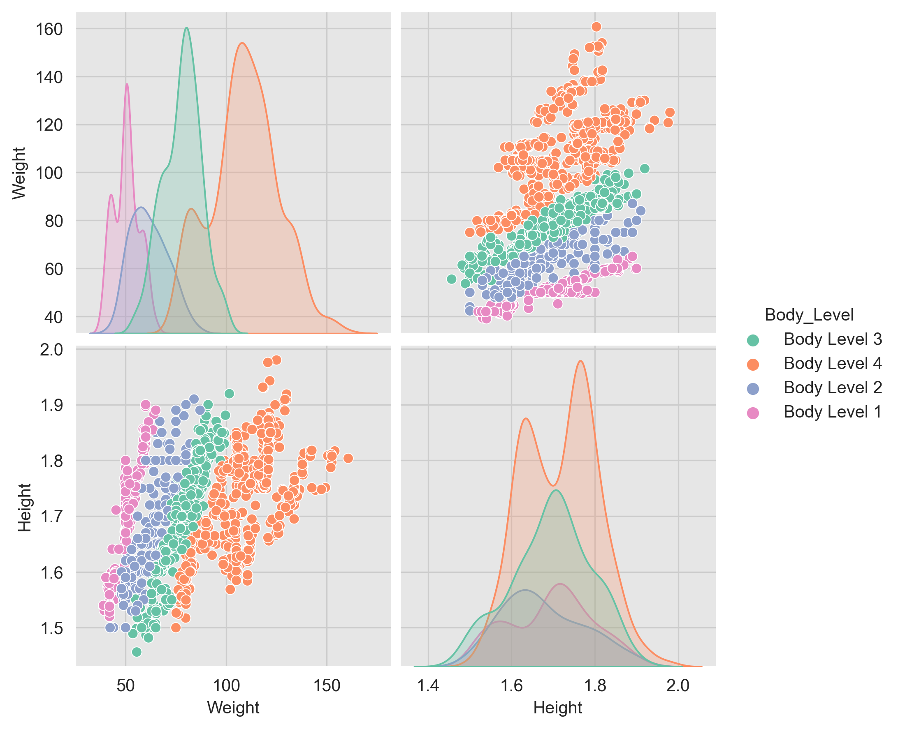
</div>

We tried to find the best formula that can represent this relation and decided to use the following formula and got some fascinating results:

$$weightOverHeightSquared = \frac{weight}{height^2}$$

<div style="display: flex; flex-direction: row; style="text-align:center"">
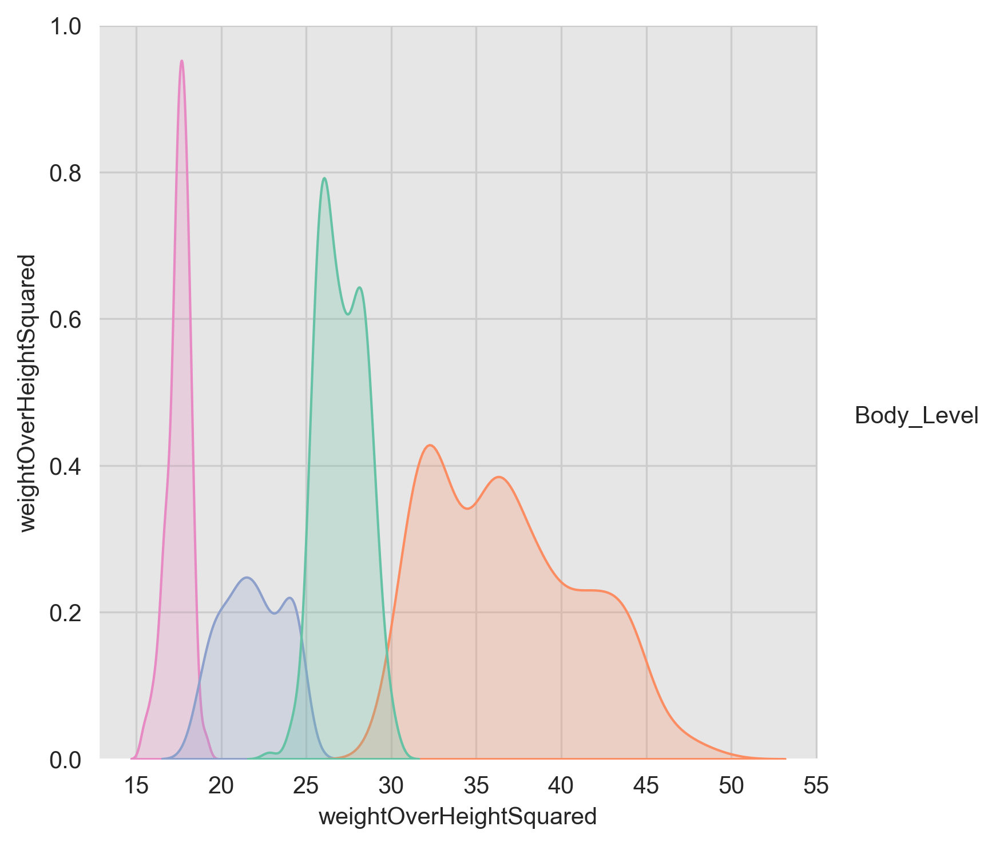

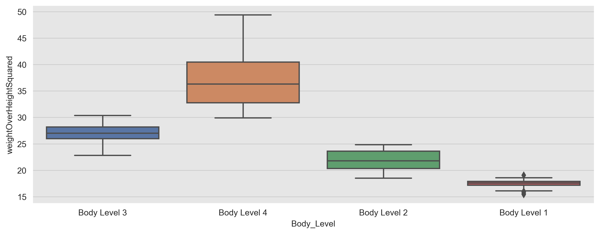
</div>

**ThresholdClassifier:**

We constructed a custom classifier called `ThresholdClassifier`, that uses the aforementioned formula to predict the body level based on some thresholds.

**Threshold Selection:**

We tried using different thresholds to predict the body level like the following:

- Using the **min value** of the weightOverHeightSquared as a threshold.
- Using the **25th percentile** of the weightOverHeightSquared as a threshold.
- Using the **mean value** of the weightOverHeightSquared as a threshold.

We found that using the min value of the weightOverHeightSquared as a threshold gives the best results.

We undergone more research and found that that this metric is called BMI(Body Mass Index). Where: $$BMI = \frac{weight}{height^2}$$

|  Body Level  | Threshold  |                                                      Health Implication                                                      |
|:-----------: |:---------: |:---------------------------------------------------------------------------------------------------------------------------: |
| Underweight  |   <18.5    |                     Increased risk of health problems such as osteoporosis, heart disease, and diabetes                      |
|    Normal    | 18.5-24.9  |                                                     Healthy body weight                                                      |
|  Overweight  |  25-29.9   |       Increased risk of health problems such as heart disease, stroke, type 2 diabetes, and certain types of cancer          |
|   Obesity    |    30<     | Significantly increased risk of health problems such as heart disease, stroke, type 2 diabetes, and certain types of cancer  |

Henceforth, we decided to use the BMI thresholds to predict the body level and got the following results after running on the full dataset:
|  Metric  |  Value  |
|:-------: |:---------: |
|  accuracy   |  0.1693480101608806  |
|  f1_score   |  0.09768666475902209  |

## Appendix

### Regularization

L2 regularization, also known as ridge regression, is a common technique used in machine learning to prevent overfitting and improve the generalization performance of a model. It achieves this by adding a penalty term to the objective function of the model.

The penalty term is proportional to the square of the L2 norm of the model's weight vector. The L2 norm of a vector is the square root of the sum of the squares of its components. In the case of the weight vector, this is equivalent to summing the squares of the individual weights. The penalty term is multiplied by a hyperparameter, lambda, which determines the strength of the regularization.

The L2 regularization objective function can be expressed as:

$$
J(\boldsymbol{\omega}) = \frac{1}{2\sigma^2}\left\lVert X\boldsymbol{\omega} - y\right\rVert_2^2 -\frac{\lambda}{2}\left\lVert \boldsymbol{\omega}\right\rVert_2^2
$$

where:

- $\boldsymbol{\omega}$ is the weight vector.
- $X$ is the input matrix.
- $y$ is the output vector.
- $\sigma^2$ is the variance.
- $\lambda$ is the regularization parameter.

The first term in this equation is the mean squared error between the predicted output and the true output, and the second term is the L2 regularization penalty term.

When training a model with L2 regularization, the objective is to find the weight vector that minimizes this objective function. By adding the L2 regularization term, the model is encouraged to find a weight vector that not only fits the training data well but also has smaller individual weights, which can help to reduce overfitting.

In practice, the value of the regularization parameter, lambda, is typically chosen through cross-validation. Larger values of lambda result in stronger regularization and smaller weights, while smaller values of lambda result in weaker regularization and larger weights. The appropriate value of lambda depends on the specific problem and data set, and finding the optimal value requires experimentation and tuning.

### Logistic Regression Parameters

In the scikit-learn implementation of logistic regression, the following parameters can be specified:

- `penalty`: This parameter controls the regularization penalty applied to the coefficients. Regularization helps prevent overfitting by reducing the magnitude of the coefficients. The two options for `penalty` are `'l1'` and `'l2'`. L1 regularization adds the absolute values of the coefficients to the objective function, while L2 regularization adds the squared values. The default value is `'l2'`.
- `C`: This is the inverse of the regularization strength and controls the trade-off between fitting the training data well and having small coefficients. Larger values of `C` result in less regularization and a better fit to the training data. The default value is `1.0`.
- `fit_intercept`: This parameter controls whether or not to include an intercept term in the model. An intercept term allows the model to capture the bias or constant term in the data. The default value is `True`.
- `solver`: This parameter specifies the algorithm to use for optimization. The options are `'lbfgs'`, `'liblinear'`, `'newton-cg'`, `'sag'`, and `'saga'`. The default value is `'lbfgs'`.
- `max_iter`: This parameter controls the maximum number of iterations for the solver to converge. The default value is `100`.

Now let's dive into the math behind logistic regression. Given a set of input variables `X` and a binary target variable `y`, logistic regression models the probability of `y` being 1 as follows:

$P(y=1|X) = \sigma(z) = \frac{1}{1 + \exp(-z)}$

where z is a linear combination of the input variables and their corresponding coefficients:

$z = b_0 + b_1 *x_1 + b_2* x_2 + ... + b_n * x_n$

The coefficients $(b_1, b_2, ..., b_n)$ are learned from the training data using a maximum likelihood estimation approach. The objective is to maximize the likelihood of observing the training data given the parameters of the logistic regression model.

To prevent overfitting, regularization is added to the objective function. L1 regularization adds the absolute values of the coefficients to the objective function, while L2 regularization adds the squared values. The strength of regularization is controlled by the `C` parameter, which is the inverse of the regularization strength.
>> Make sure to check [The C parameter and the maximum-a-posterior Estimation](#the-c-parameter-and-the-maximum-a-posterior-estimation) section.

The optimization problem is solved using an iterative algorithm that updates the coefficients until convergence. The specific algorithm used is controlled by the `solver` parameter. For example, the `'lbfgs'` solver uses the Limited-memory Broyden-Fletcher-Goldfarb-Shanno algorithm, while the `'liblinear'` solver uses a coordinate descent algorithm.

In summary, logistic regression is a powerful algorithm for binary classification tasks that models the probability of a binary response variable as a function of one or more predictor variables. By controlling the regularization penalty and optimization algorithm, logistic regression can be tuned to achieve better performance on a wide range of problems.

### The C parameter and the maximum-a-posterior Estimation

Using regularization is equivalent to using a maximum-a-posterior Estimation with a prior distribution (We assume conjugate prior to the likelihood to obtain a closed-form representation of posterior.)

The MAP criterion is derived from Bayes Rule, i.e.

```math
\begin{equation}
P(A \vert B) = \frac{P(B \vert A)P(A)}{P(B)} 
\end{equation}
```

If $B$ is chosen to be our data $X$ and $A$ is chosen to be the parameters that you'd want to estimate, call it $w$, we will get

```math
\begin{equation}
\underbrace{P(w \vert {X})}_{\text{Posterior}} = 
\frac{1}{\underbrace{P({X})}_{\text{Normalization}}}
\overbrace{P({X} \vert w)}^{\text{Likelihood}}\overbrace{P(w)}^{\text{Prior}}  \tag{0}
\end{equation}
```

And by introducing $y$:

$$
p(\boldsymbol{\omega} | X, y) = \frac{p(y | X, \boldsymbol{\omega})P(\boldsymbol{\omega})}{p(y | X)}
$$

For mathematical convince, we can write is as follows:
$$\boldsymbol{\hat{\omega}}_{MAP} = \arg\max_{\boldsymbol{\omega}} p(y | X, {\omega})P({\omega})$$

The above equation is the Maximum A Posteriori (MAP) estimation for the parameter vector $\boldsymbol{\omega}$, given the data matrix $X$ and the output vector $y$. It aims to find the values of $\boldsymbol{\omega}$ that maximize the posterior probability $p(\boldsymbol{\omega} | X, y)$.

Taking the logarithm of both sides of the equation above, we have:

$$
\ln p(\boldsymbol{\omega} | X, y) = \ln p(y | X, \boldsymbol{\omega}) + \ln P(\boldsymbol{\omega}) - \ln p(y | X)\\
$$

Since the term $-\ln p(y | X)$ is constant with respect to $\boldsymbol{\omega}$, maximizing $\ln p(\boldsymbol{\omega} | X, y)$ is equivalent to maximizing $\ln p(y | X, \boldsymbol{\omega}) + \ln P(\boldsymbol{\omega})$. Using the logarithmic identities $\ln a + \ln b = \ln ab$ and $\ln a^n = n\ln a$, we can further simplify the expression as:

$$
\ln p(y | X, \boldsymbol{\omega}) + \ln P(\boldsymbol{\omega}) = \sum_{i=1}^n \ln p(y_i | \boldsymbol{x}_i, \boldsymbol{\omega}) + \ln P(\boldsymbol{\omega})\\
= \sum_{i=1}^n \ln p(y_i | \boldsymbol{x}_i, \boldsymbol{\omega}) + \ln P(\boldsymbol{\omega})$$

We can take the $-$ sign outside and convert our problem into a minimization one as follows:
$$\boldsymbol{\hat{\omega}}_{MAP} = \arg\min_{\boldsymbol{\omega}} p(y | X, {\omega})P({\omega})$$

$$
= \sum_{i=1}^n \ln \frac{1}{\sqrt{2\pi\sigma^2}}\exp\left(-\frac{(y_i - \boldsymbol{x}_i^T\boldsymbol{\omega})^2}{2\sigma^2}\right) + \ln P(\boldsymbol{\omega})$$
We can remove some of the constants as they won't affect our result.

$$
= \frac{1}{2\sigma^2}\left\lVert X\boldsymbol{\omega} - y\right\rVert_2^2 +  \ln P(\boldsymbol{\omega})\\
$$

where $\boldsymbol{x}_i$ is the $i$-th row of $X$, $\sigma^2$ is the variance of the noise in the data, and $\left\lVert X\boldsymbol{\omega} -y \right\rVert_2^2$ is the squared Euclidean distance between the predicted outputs $X\boldsymbol{\omega}$ and the true outputs $y$.

Now, we can expand the second term of the given equation to the L2 regularization form as follows:

$$
\ln P(\boldsymbol{\omega}) = \ln \exp(-\frac{\lambda}{2}\left\lVert \boldsymbol{\omega}\right\rVert_2^2) \\
= -\frac{\lambda}{2}\left\lVert \boldsymbol{\omega}\right\rVert_2^2
$$

where $\lambda$ is a hyperparameter that controls the strength of regularization and we used the fact that $\ln \exp(x) = x$.

Substituting this into the given equation, we get:

$$
= \frac{1}{2\sigma^2}\left\lVert X\boldsymbol{\omega} - y\right\rVert_2^2 -\frac{\lambda}{2}\left\lVert \boldsymbol{\omega}\right\rVert_2^2
$$

This is the same as the cost function with L2 regularization, where the regularization parameter $\lambda$ controls the strength of regularization.

The L2 regularization term penalizes the magnitude of the coefficients of the model by adding a penalty term to the cost function. This penalty term is proportional to the square of the L2 norm of the coefficient vector. Mathematically, the L2 regularization term can be expressed as:

### Gini Value in a Random Forest Tree Plot

The Gini value in a random forest tree plot represents the impurity of a particular node in the decision tree. In a decision tree, each node represents a split on a feature that is used to separate the data into two or more subsets. The Gini value is a measure of the probability of misclassification of a random sample from the dataset. It ranges from 0 to 1, where 0 indicates that all the samples in the node belong to the same class, and 1 indicates that the samples are equally distributed across all classes.

In the context of a random forest, the Gini value is calculated for each feature at each node in each tree of the forest. The feature with the lowest Gini value is selected as the split for that node. By doing this, the random forest can effectively identify the most important features for classification and make accurate predictions on new data. The Gini value can also be used to assess the overall performance of the random forest, with lower Gini values indicating better classification performance.

### Bias-variance Tradeoff

Bias refers to the error that is introduced by approximating a real-world problem with a simplified model. A high bias model is one that is too simplistic and cannot capture the underlying patterns in the data. This often results in an underfit model that has high training error and poor performance on both the training and testing datasets. On the other hand, a low bias model is one that is complex enough to capture the underlying patterns in the data. This often results in a well-fitted model that has low training error and good performance on both the training and testing datasets.

Variance, on the other hand, refers to the amount by which the prediction of the model would change if we trained it on a different dataset. A high variance model is one that is too sensitive to the training data and cannot generalize well to new, unseen data. This often results in an overfit model that has low training error but poor performance on the testing dataset. On the other hand, a low variance model is one that is less sensitive to the training data and can generalize well to new, unseen data. This often results in a well-fitted model that has low training error and good performance on the testing dataset.

In general, the goal is to find a model with both low bias and low variance. This is often achieved through:

- Feature selection: Selecting a subset of features that are most relevant to the target variable. That's why we chose the `Weight` and `Height` features.
- Regularization: This involves adding a penalty to the loss function, which helps to reduce the complexity of the model as discussed in the previous sections.
- Ensemble learning: This involves combining the predictions of multiple models, which helps to reduce the variance of the predictions.

It is important to note that the trade-off between bias and variance depends on the specific problem and dataset at hand. In some cases, a more complex model may be necessary to capture the underlying patterns in the data, even if it comes at the cost of higher variance. In other cases, a simpler model may be sufficient, even if it comes at the cost of higher bias.
